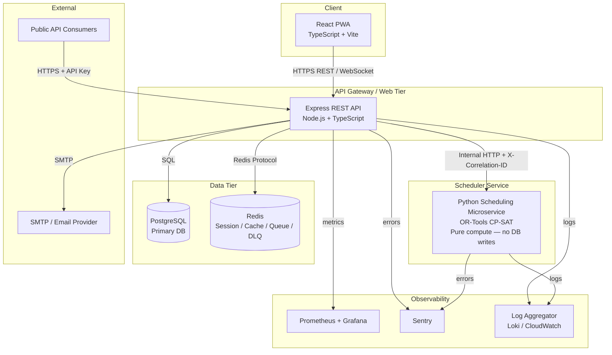
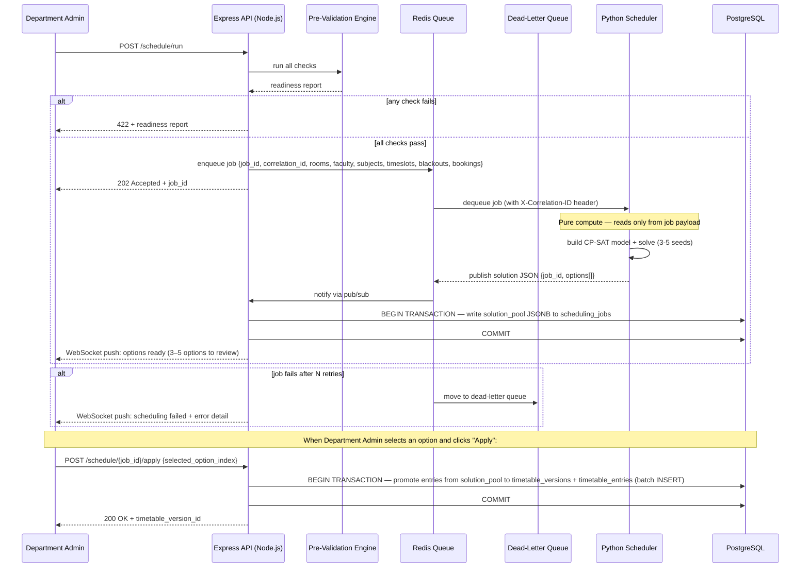
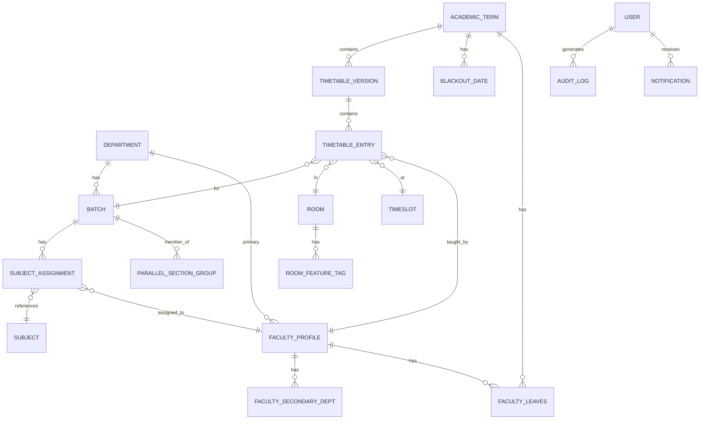

# Design Document: Smart Timetable Management System

## Overview

The Smart Timetable Management System is a full-stack web application that automates academic timetable scheduling for a single Higher Education Institution. It uses Google OR-Tools CP-SAT solver to generate 3–5 conflict-free timetable options from a rich set of hard and soft constraints, then provides a collaborative review, editing, and approval workflow.

The system is built around a **React + TypeScript** frontend (PWA-capable), a **Node.js/Express** REST API backend, and a **PostgreSQL** database. The scheduling engine runs as a separate **Python microservice** that wraps OR-Tools CP-SAT and communicates with the main backend over an internal HTTP API. This separation keeps the computationally intensive solver isolated from the web tier and allows independent scaling.

Key design decisions:
- **Solver isolation**: Python microservice is pure compute — it receives all needed data in the job payload and returns a solution JSON. The Node.js backend owns all DB writes inside a single Postgres transaction.
- **Optimistic locking**: Version-number-based concurrency control on all timetable records.
- **Dual-language i18n**: All UI strings externalized from day one (English + Telugu).
- **PWA service worker**: Faculty timetable view cached for offline access.
- **Public API**: Separate rate-limited, API-key-authenticated read-only endpoints with DPDP anonymization.
- **Distributed tracing**: Correlation IDs propagated across Node ↔ Python ↔ Redis for end-to-end debugging.

---

## Architecture



### Component Responsibilities

| Component | Responsibility |
|---|---|
| React PWA | UI rendering, drag-drop editor, PWA service worker, i18n |
| Express API | Auth, RBAC, CRUD for all entities, notifications, public API, pre-validation, **all DB writes** |
| Python Scheduler | CP-SAT model construction, solution pool generation, infeasibility reporting — **returns JSON only, no DB access** |
| PostgreSQL | Persistent storage for all entities, audit logs, timetable versions |
| Redis | JWT denylist, session cache, scheduling job queue, dead-letter queue, pub/sub for real-time indicators |


### Request Flow: Scheduling Run



**Write ownership rule**: The Python service never connects to PostgreSQL. It receives all required data (rooms, faculty, subjects, timeslots, blackout dates, existing bookings) in the job payload and returns a solution JSON. The Node.js backend is the sole writer to the database.

**Two-phase write strategy**:
1. **Staging phase** — When the solver returns, the Node.js backend writes the entire `options[]` array as a `solution_pool JSONB` column in the `scheduling_jobs` table inside a single Postgres transaction. No rows are written to `timetable_versions` or `timetable_entries` yet.
2. **Promotion phase** — Only when the Department Admin explicitly selects one option and clicks "Apply" does the Node.js backend promote those entries to the main relational tables (`timetable_versions` + `timetable_entries`) inside a new transaction, using batch INSERT statements (see Batch Inserts note below).

This keeps the hot relational tables clean of unreviewed drafts and makes the "discard all other options" operation a simple row delete on `scheduling_jobs`.

---

## Components and Interfaces

### 1. Authentication & RBAC Module

- **JWT issuance**: HS256, 8-hour expiry, stored in HttpOnly + SameSite=Strict cookie.
- **Token invalidation**: On logout or expiry, token ID added to Redis denylist (TTL = remaining token lifetime).
- **RBAC middleware**: Express middleware reads role from JWT payload and checks against a permission matrix.
- **Rate limiting**: `express-rate-limit` — 5 failed attempts per IP per 15 min; account lock after 10 consecutive failures (stored in Redis).
- **Audit log**: Every mutating request writes an `audit_logs` row via a post-handler middleware.

Permission matrix (abbreviated):

| Feature | Super_Admin | Dept_Admin | Faculty | Authority |
|---|---|---|---|---|
| User management | ✓ | — | — | — |
| Room CRUD | ✓ | — | — | — |
| Batch CRUD | ✓ | own dept | — | — |
| Subject CRUD | ✓ | own dept | — | — |
| Run scheduler | ✓ | own dept | — | — |
| Approve timetable | — | — | — | ✓ |
| View timetable | ✓ | own dept | own | ✓ |

### 2. Pre-Validation Engine

Runs synchronously before every scheduling attempt. Executes 9 check categories (Req 16.1 a–i) plus Req 23.4 (room feature tags), Req 24.3 (batch weekly load), and Req 26.7 (fixed slot on blackout date). Returns a `ReadinessReport` object:

```typescript
interface ReadinessReport {
  score: number;          // 0–100 percentage
  passed: number;
  total: number;
  failures: CheckFailure[];
}

interface CheckFailure {
  checkId: string;
  description: string;
  configUrl: string;      // deep link to fix screen
}
```

### 3. Python Scheduling Microservice

**Design principle**: Pure compute service. No database connection. Receives all required data in the job payload, returns solution JSON. The Node.js backend is responsible for all DB writes.

**Internal API** (not exposed publicly):

| Endpoint | Method | Description |
|---|---|---|
| `/solve` | POST | Accept job payload, run CP-SAT, return solution pool |
| `/health` | GET | Liveness probe |

**Job payload** (JSON) — includes room availability data explicitly so Python needs no DB joins:
```json
{
  "job_id": "uuid",
  "correlation_id": "uuid",
  "term_id": "uuid",
  "department_id": "uuid",
  "rooms": [
    {
      "id": "uuid",
      "room_type": "Classroom",
      "capacity": 60,
      "building": "Block A",
      "available_days": ["Mon","Tue","Wed","Thu","Fri"],
      "features": ["Projector","AC"],
      "blocked_slots": [
        {"day": "Mon", "timeslot_id": "uuid", "reason": "blackout"},
        {"day": "Tue", "timeslot_id": "uuid", "reason": "booking"}
      ]
    }
  ],
  "faculty": [...],
  "subjects": [...],
  "batches": [...],
  "timeslots": [...],
  "blackout_dates": [...],
  "soft_weights": {"gap_minimization": 3, "even_distribution": 5},
  "timeout_seconds": 30
}
```

The `blocked_slots` array on each room merges both blackout dates and existing room bookings, computed by the Node.js backend before enqueuing. This means the Python service can enforce room availability as a hard constraint without any DB access.

**Solution pool strategy**: Run CP-SAT solver 3–5 times with different random seeds (`cp_model.CpSolver.parameters.random_seed`). Each run uses the same model but a different seed, producing structurally distinct solutions. All solutions must satisfy all hard constraints.

**Response payload**:
```json
{
  "job_id": "uuid",
  "correlation_id": "uuid",
  "status": "success",
  "options": [
    {
      "seed": 42,
      "conflict_score": 12,
      "quality_pct": 94,
      "utilization_rate": 0.74,
      "entries": [
        {
          "batch_id": "uuid",
          "subject_id": "uuid",
          "faculty_id": "uuid",
          "room_id": "uuid",
          "timeslot_id": "uuid",
          "day": "Mon",
          "is_lab_block": false
        }
      ]
    }
  ],
  "infeasibility_report": null
}
```

**Conflict score calculation**:
```
conflict_score = Σ (violation_count_i × weight_i)  for each soft constraint i
```

**Normalized quality percentage** (computed by the Node.js backend after receiving the solution pool):
```
quality_pct = 100 - (conflict_score / max_possible_score) * 100
```
where `max_possible_score` is the theoretical maximum penalty if every soft constraint were violated at maximum weight. The UI displays this as **"94% Optimized"** rather than a raw penalty number, making it immediately interpretable for non-technical Department Admins. The `quality_pct` is stored alongside `conflict_score` in the `scheduling_jobs` table (see Data Models).

### 4. Redis Job Queue & Dead-Letter Queue

- **Queue library**: BullMQ (Node.js) with Redis backend.
- **Worker concurrency cap**: The BullMQ worker is configured with `concurrency: os.cpus().length` (N = number of CPU cores). Even if the Redis queue contains many pending jobs, the Python worker processes at most N jobs simultaneously. This prevents CPU spike and memory exhaustion from a thundering-herd burst of scheduling requests.
- **Job retry strategy**: Exponential backoff — retries at 5s, 15s, 45s (3 attempts total).
- **Dead-letter queue**: After 3 failed attempts, job moves to `scheduling:dlq`. A separate worker monitors the DLQ and sends a failure notification to the Department Admin via WebSocket and email.
- **Job TTL**: Completed jobs retained for 24 hours for debugging; failed jobs retained for 7 days.
- **Correlation ID**: Every job carries a `correlation_id` UUID that is propagated in the `X-Correlation-ID` HTTP header to the Python service and included in all log entries for that job.

### 5. Distributed Tracing & Correlation IDs

Every request entering the Express API is assigned a `correlation_id` (UUID v4) if one is not already present in the `X-Correlation-ID` header. This ID is:
- Attached to all log entries for that request (via `pino` structured logging).
- Forwarded in the `X-Correlation-ID` header to the Python scheduler.
- Stored in the Redis job payload.
- Included in WebSocket push events so the frontend can correlate UI state with server logs.
- Returned in all error responses as `{"error": "...", "correlation_id": "..."}`.

This enables end-to-end trace reconstruction across Node ↔ Python ↔ Redis from a single ID.

### 6. Drag-Drop Editor & Conflict Resolver

- Frontend: React DnD library for drag-drop interactions.
- On drop: POST `/timetable/{id}/move` with `{from_slot, to_slot, assignment_id, version}`.
- Backend re-validates all hard constraints for the affected timeslot pair.
- If violation detected: returns `409 Conflict` with `ConflictDetail` and 2–3 `SwapSuggestion` objects.
- Conflict Resolver suggestions are generated by a greedy search over neighboring slots, ranked by Conflict_Score delta.

### 7. Notification Service

- In-app: stored in `notifications` table; WebSocket push via Socket.io.
- Email: queued in Redis (BullMQ), processed by a worker using Nodemailer + SMTP.
- Retry: exponential backoff (1s, 2s, 4s) up to 3 retries; failures marked in `notification_deliveries`.
- User preferences: per-user, per-type toggle stored in `notification_preferences`.

### 8. Public API

Separate Express router mounted at `/api/v1/public`. API key validated via `Authorization: Bearer <key>` header. Rate limited at 100 req/min per key via Redis sliding window. DPDP anonymization applied by default unless key has `data_access_consent` flag.

### 9. PWA / Offline Support

- Vite PWA plugin generates service worker.
- Caches current-week timetable JSON on first load.
- **Version hash in cached response**: The service worker stores a `version_hash` (SHA-256 of the timetable payload) or a `Last-Modified` timestamp in the cached timetable response header. On every background sync, the service worker compares the local cached version against the server's `ETag` / `Last-Modified`. If the server version is newer, the PWA displays a prominent **"Timetable Updated — Refresh Needed"** banner prompting the user to reload, ensuring faculty are never silently viewing a stale schedule.
- Background sync on reconnect: fetches `/api/timetable/{faculty_id}?since={last_sync_ts}`.
- Offline indicator: `navigator.onLine` event listener updates UI banner.

### 10. Excel Importer

- Library: `xlsx` (SheetJS) for parsing.
- Validation: same Zod schemas used by REST endpoints.
- Atomicity: all rows inserted in a single PostgreSQL transaction; rollback on any error.
- Error report: array of `{row, field, message}` returned to client.

### 11. Internationalization (i18n)

- **Library**: `i18next` with `react-i18next` bindings. All UI strings, error messages, validation messages, and notification text are stored in JSON resource files under `src/locales/{lang}/translation.json`. No string is hardcoded in component JSX.
- **Supported languages**: English (`en`) and Telugu (`te`) from initial release. Missing Telugu keys fall back to English automatically via i18next's `fallbackLng` option.
- **Language switching**: User preference stored in `localStorage` and applied on mount; Super_Admin can set the institution default via a system setting.
- **PDF export**: The PDF exporter reads the active i18next language and uses the corresponding resource file for all labels, day names, and metadata fields.
- **Database collation**: The PostgreSQL database must be created with **UTF-8 encoding** and **`und-x-icu` collation** (ICU-based Unicode collation). This ensures correct alphabetical sorting of Telugu script names (faculty names, subject names, department names) in ORDER BY queries and index scans. Example:
  ```sql
  CREATE DATABASE timetable_db
    ENCODING 'UTF8'
    LC_COLLATE 'und-x-icu'
    LC_CTYPE 'und-x-icu'
    TEMPLATE template0;
  ```
- **Excel import**: The `xlsx` parser reads cell values as Unicode strings; Telugu script names pass through the same Zod validation schemas without special handling.

### 12. Guided Setup Wizard

- Frontend multi-step form with step state persisted in `wizard_progress` table (keyed by user + term).
- Step completion gated by server-side check: each step has a `/wizard/step/{n}/status` endpoint.
- Step 7 triggers Pre-Validation Engine and blocks advance if score < 100%.

---


## Data Models

### Entity Relationship Overview



### Core Tables (PostgreSQL)

```sql
-- Users & Auth
CREATE TABLE users (
  id UUID PRIMARY KEY DEFAULT gen_random_uuid(),
  email TEXT UNIQUE NOT NULL,
  password_hash TEXT NOT NULL,          -- bcrypt cost 12
  role TEXT NOT NULL CHECK (role IN ('Super_Admin','Department_Admin','Faculty','Authority')),
  department_id UUID REFERENCES departments(id),
  is_active BOOLEAN DEFAULT TRUE,
  failed_login_count INT DEFAULT 0,
  locked_until TIMESTAMPTZ,
  created_at TIMESTAMPTZ DEFAULT NOW(),
  updated_at TIMESTAMPTZ DEFAULT NOW()
);

-- Academic Terms
CREATE TABLE academic_terms (
  id UUID PRIMARY KEY DEFAULT gen_random_uuid(),
  label TEXT UNIQUE NOT NULL,           -- e.g. "2026_Sem1"
  start_date DATE NOT NULL,
  end_date DATE NOT NULL,
  is_active BOOLEAN DEFAULT FALSE
);

-- Departments
CREATE TABLE departments (
  id UUID PRIMARY KEY DEFAULT gen_random_uuid(),
  name TEXT NOT NULL,
  code TEXT UNIQUE NOT NULL
);

-- Rooms
CREATE TABLE rooms (
  id UUID PRIMARY KEY DEFAULT gen_random_uuid(),
  room_number TEXT NOT NULL,
  room_type TEXT NOT NULL CHECK (room_type IN ('Classroom','Lab','Seminar_Hall')),
  capacity INT NOT NULL CHECK (capacity > 0),
  building TEXT NOT NULL,
  available_days TEXT[] NOT NULL,       -- subset of ['Mon','Tue','Wed','Thu','Fri','Sat']
  is_active BOOLEAN DEFAULT TRUE
);

CREATE TABLE room_feature_tags (
  room_id UUID REFERENCES rooms(id) ON DELETE CASCADE,
  tag TEXT NOT NULL,
  PRIMARY KEY (room_id, tag)
);

-- Timeslots
CREATE TABLE timeslots (
  id UUID PRIMARY KEY DEFAULT gen_random_uuid(),
  label TEXT NOT NULL,
  start_time TIME NOT NULL,
  end_time TIME NOT NULL,
  shift TEXT NOT NULL CHECK (shift IN ('Morning','Evening')),
  is_break BOOLEAN DEFAULT FALSE,
  is_lab_block_start BOOLEAN DEFAULT FALSE,
  lab_block_partner_id UUID REFERENCES timeslots(id)
);

-- Batches
CREATE TABLE batches (
  id UUID PRIMARY KEY DEFAULT gen_random_uuid(),
  department_id UUID NOT NULL REFERENCES departments(id),
  academic_year TEXT NOT NULL,
  section_label TEXT NOT NULL,
  student_strength INT NOT NULL CHECK (student_strength > 0),
  max_weekly_classes INT,
  UNIQUE (department_id, academic_year, section_label)
);

-- Faculty
CREATE TABLE faculty_profiles (
  id UUID PRIMARY KEY DEFAULT gen_random_uuid(),
  user_id UUID REFERENCES users(id),
  full_name TEXT NOT NULL,
  primary_department_id UUID NOT NULL REFERENCES departments(id),
  max_classes_per_day INT NOT NULL,
  max_classes_per_week INT NOT NULL,
  avg_leave_days_per_month NUMERIC(4,1),
  consecutive_class_limit INT NOT NULL DEFAULT 2
);

CREATE TABLE faculty_secondary_depts (
  faculty_id UUID REFERENCES faculty_profiles(id) ON DELETE CASCADE,
  department_id UUID REFERENCES departments(id),
  workload_pct NUMERIC(5,2) NOT NULL,
  PRIMARY KEY (faculty_id, department_id)
);

CREATE TABLE faculty_timeslot_prefs (
  faculty_id UUID REFERENCES faculty_profiles(id) ON DELETE CASCADE,
  timeslot_id UUID REFERENCES timeslots(id),
  pref_type TEXT NOT NULL CHECK (pref_type IN ('preferred','not_available')),
  PRIMARY KEY (faculty_id, timeslot_id, pref_type)
);

-- Faculty Leaves (required for Req 13: Dynamic Rescheduling)
CREATE TABLE faculty_leaves (
  id UUID PRIMARY KEY DEFAULT gen_random_uuid(),
  faculty_id UUID NOT NULL REFERENCES faculty_profiles(id) ON DELETE CASCADE,
  term_id UUID NOT NULL REFERENCES academic_terms(id),
  date_start DATE NOT NULL,
  date_end DATE NOT NULL,
  leave_type TEXT NOT NULL,             -- e.g. 'Sick', 'Casual', 'Official'
  status TEXT NOT NULL DEFAULT 'Approved',
  created_at TIMESTAMPTZ DEFAULT NOW()
);

-- Subjects
CREATE TABLE subjects (
  id UUID PRIMARY KEY DEFAULT gen_random_uuid(),
  department_id UUID NOT NULL REFERENCES departments(id),
  name TEXT NOT NULL,
  code TEXT NOT NULL,
  subject_type TEXT NOT NULL CHECK (subject_type IN ('Theory','Lab','Elective')),
  weekly_hours INT NOT NULL,
  classes_per_week INT NOT NULL,
  preferred_room_type TEXT CHECK (preferred_room_type IN ('Classroom','Lab','Seminar_Hall')),
  required_room_features TEXT[],
  fixed_timeslot_id UUID REFERENCES timeslots(id),
  fixed_day TEXT
);

CREATE TABLE session_duration_rules (
  id UUID PRIMARY KEY DEFAULT gen_random_uuid(),
  subject_id UUID NOT NULL REFERENCES subjects(id) ON DELETE CASCADE,
  session_durations INT[] NOT NULL      -- e.g. [2,1] for a 3hr/week subject split as 2+1
);

-- Subject Assignments (subject → batch → faculty for a term)
CREATE TABLE subject_assignments (
  id UUID PRIMARY KEY DEFAULT gen_random_uuid(),
  term_id UUID NOT NULL REFERENCES academic_terms(id),
  subject_id UUID NOT NULL REFERENCES subjects(id),
  batch_id UUID NOT NULL REFERENCES batches(id),
  faculty_id UUID NOT NULL REFERENCES faculty_profiles(id),
  UNIQUE (term_id, subject_id, batch_id)
);

-- Parallel Sections
CREATE TABLE parallel_section_groups (
  id UUID PRIMARY KEY DEFAULT gen_random_uuid(),
  term_id UUID NOT NULL REFERENCES academic_terms(id),
  subject_id UUID NOT NULL REFERENCES subjects(id)
);

CREATE TABLE parallel_section_members (
  group_id UUID REFERENCES parallel_section_groups(id) ON DELETE CASCADE,
  batch_id UUID REFERENCES batches(id),
  PRIMARY KEY (group_id, batch_id)
);

-- Elective Groups
CREATE TABLE elective_groups (
  id UUID PRIMARY KEY DEFAULT gen_random_uuid(),
  term_id UUID NOT NULL REFERENCES academic_terms(id),
  subject_id UUID NOT NULL REFERENCES subjects(id)
);

CREATE TABLE elective_group_batches (
  group_id UUID REFERENCES elective_groups(id) ON DELETE CASCADE,
  batch_id UUID REFERENCES batches(id),
  PRIMARY KEY (group_id, batch_id)
);

-- Timetable Versions
CREATE TABLE timetable_versions (
  id UUID PRIMARY KEY DEFAULT gen_random_uuid(),
  term_id UUID NOT NULL REFERENCES academic_terms(id),
  department_id UUID NOT NULL REFERENCES departments(id),
  version_label TEXT NOT NULL,          -- e.g. "Draft_v1", "Published_v1"
  status TEXT NOT NULL CHECK (status IN ('Draft','Pending_Approval','Published','Rejected')),
  conflict_score INT,
  quality_pct NUMERIC(5,2),         -- 100 - (conflict_score / max_possible_score) * 100; displayed as "94% Optimized"
  utilization_rate NUMERIC(5,2),
  rejection_reason TEXT,
  submitted_by UUID REFERENCES users(id),
  reviewed_by UUID REFERENCES users(id),
  version_number INT NOT NULL DEFAULT 1, -- optimistic lock
  public_token UUID,
  public_token_type TEXT CHECK (public_token_type IN ('permanent','short_lived')),
  created_at TIMESTAMPTZ DEFAULT NOW(),
  updated_at TIMESTAMPTZ DEFAULT NOW(),
  UNIQUE (term_id, department_id, version_label)
);

-- Timetable Entries
CREATE TABLE timetable_entries (
  id UUID PRIMARY KEY DEFAULT gen_random_uuid(),
  timetable_version_id UUID NOT NULL REFERENCES timetable_versions(id) ON DELETE CASCADE,
  batch_id UUID NOT NULL REFERENCES batches(id),
  subject_id UUID NOT NULL REFERENCES subjects(id),
  faculty_id UUID NOT NULL REFERENCES faculty_profiles(id),
  room_id UUID NOT NULL REFERENCES rooms(id),
  timeslot_id UUID NOT NULL REFERENCES timeslots(id),
  day TEXT NOT NULL,
  is_lab_block BOOLEAN DEFAULT FALSE,
  version_number INT NOT NULL DEFAULT 1
);

-- Room Bookings (ad-hoc)
CREATE TABLE room_bookings (
  id UUID PRIMARY KEY DEFAULT gen_random_uuid(),
  room_id UUID NOT NULL REFERENCES rooms(id),
  booked_by UUID NOT NULL REFERENCES users(id),
  booking_date DATE NOT NULL,
  timeslot_id UUID NOT NULL REFERENCES timeslots(id),
  label TEXT,
  created_at TIMESTAMPTZ DEFAULT NOW()
);

-- Blackout Dates
CREATE TABLE blackout_dates (
  id UUID PRIMARY KEY DEFAULT gen_random_uuid(),
  term_id UUID NOT NULL REFERENCES academic_terms(id),
  date_start DATE NOT NULL,
  date_end DATE NOT NULL,
  label TEXT NOT NULL,
  scope TEXT NOT NULL CHECK (scope IN ('institution','department')),
  department_id UUID REFERENCES departments(id)
);

-- Notifications
CREATE TABLE notifications (
  id UUID PRIMARY KEY DEFAULT gen_random_uuid(),
  user_id UUID NOT NULL REFERENCES users(id),
  type TEXT NOT NULL,
  payload JSONB NOT NULL,
  is_read BOOLEAN DEFAULT FALSE,
  created_at TIMESTAMPTZ DEFAULT NOW()
);

CREATE TABLE notification_preferences (
  user_id UUID REFERENCES users(id) ON DELETE CASCADE,
  notification_type TEXT NOT NULL,
  email_enabled BOOLEAN DEFAULT TRUE,
  PRIMARY KEY (user_id, notification_type)
);

-- Audit Log
CREATE TABLE audit_logs (
  id UUID PRIMARY KEY DEFAULT gen_random_uuid(),
  user_id UUID NOT NULL REFERENCES users(id),
  role TEXT NOT NULL,
  action TEXT NOT NULL,
  resource_type TEXT NOT NULL,
  resource_id UUID,
  metadata JSONB,
  created_at TIMESTAMPTZ DEFAULT NOW()
);

-- Soft Constraint Weights
CREATE TABLE soft_constraint_weights (
  term_id UUID REFERENCES academic_terms(id),
  constraint_key TEXT NOT NULL,
  weight INT NOT NULL CHECK (weight BETWEEN 1 AND 10),
  PRIMARY KEY (term_id, constraint_key)
);

-- Public API Keys
CREATE TABLE api_keys (
  id UUID PRIMARY KEY DEFAULT gen_random_uuid(),
  key_hash TEXT UNIQUE NOT NULL,
  label TEXT,
  data_access_consent BOOLEAN DEFAULT FALSE,
  rate_limit_per_min INT DEFAULT 100,
  is_active BOOLEAN DEFAULT TRUE,
  created_at TIMESTAMPTZ DEFAULT NOW()
);

-- Wizard Progress
CREATE TABLE wizard_progress (
  user_id UUID REFERENCES users(id),
  term_id UUID REFERENCES academic_terms(id),
  current_step INT NOT NULL DEFAULT 1,
  completed_steps INT[] DEFAULT '{}',
  PRIMARY KEY (user_id, term_id)
);

-- Scheduling Jobs (solution pool staging — entries live here until Department Admin clicks "Apply")
CREATE TABLE scheduling_jobs (
  id UUID PRIMARY KEY DEFAULT gen_random_uuid(),
  term_id UUID NOT NULL REFERENCES academic_terms(id),
  department_id UUID NOT NULL REFERENCES departments(id),
  status TEXT NOT NULL CHECK (status IN ('pending','running','completed','failed','applied')),
  correlation_id UUID NOT NULL,
  solution_pool JSONB,              -- raw options[] array returned by Python solver
  selected_option_index INT,        -- set when Department Admin clicks "Apply"
  error_detail JSONB,               -- infeasibility report or exception info on failure
  created_at TIMESTAMPTZ DEFAULT NOW(),
  updated_at TIMESTAMPTZ DEFAULT NOW()
);

CREATE INDEX idx_scheduling_jobs_dept_term ON scheduling_jobs(department_id, term_id, status);
```

### Key Indexes

```sql
-- Core query patterns
CREATE INDEX idx_timetable_entries_version ON timetable_entries(timetable_version_id);
CREATE INDEX idx_timetable_entries_room_timeslot ON timetable_entries(room_id, timeslot_id, day);
CREATE INDEX idx_timetable_entries_faculty_timeslot ON timetable_entries(faculty_id, timeslot_id, day);
-- Performance indexes from review
CREATE INDEX idx_timetable_entries_day_timeslot ON timetable_entries(day, timeslot_id);
CREATE INDEX idx_faculty_leaves_faculty_date ON faculty_leaves(faculty_id, date_start);
-- Supporting indexes
CREATE INDEX idx_audit_logs_user ON audit_logs(user_id, created_at DESC);
CREATE INDEX idx_notifications_user_unread ON notifications(user_id) WHERE is_read = FALSE;
CREATE INDEX idx_blackout_dates_term ON blackout_dates(term_id, date_start, date_end);
CREATE INDEX idx_subject_assignments_term_batch ON subject_assignments(term_id, batch_id);
```

### Batch Insert Requirement

During the promotion phase (when a Department Admin applies a selected option), all `timetable_entries` rows for that option must be inserted using a **single batch INSERT statement**:

```sql
INSERT INTO timetable_entries (timetable_version_id, batch_id, subject_id, faculty_id, room_id, timeslot_id, day, is_lab_block, version_number)
VALUES
  ($1, $2, $3, $4, $5, $6, $7, $8, 1),
  ($9, $10, $11, $12, $13, $14, $15, $16, 1),
  ...
```

Individual per-row inserts are explicitly prohibited for this operation. A typical timetable for 50 batches can produce 500–1,000 entries; batching reduces round-trips from O(N) to O(1) and keeps the promotion transaction fast enough to stay within the 2-second response SLA (Req 19.4).

---


## Correctness Properties

*A property is a characteristic or behavior that should hold true across all valid executions of a system — essentially, a formal statement about what the system should do. Properties serve as the bridge between human-readable specifications and machine-verifiable correctness guarantees.*

### Property 1: JWT Authentication Round-Trip

*For any* valid (email, password) credential pair, authenticating and then decoding the returned JWT token should yield a token with the correct user ID, role, and an expiry time approximately 8 hours from issuance.

**Validates: Requirements 1.1**

---

### Property 2: Invalid Credentials Always Rejected

*For any* credential pair where either the email does not exist in the system or the password does not match the stored hash, the authentication response must be a rejection (HTTP 401) and must not reveal which field was incorrect.

**Validates: Requirements 1.2**

---

### Property 3: RBAC Permission Enforcement

*For any* authenticated user with a given role, attempting to access an endpoint outside that role's permission set should always return HTTP 403, regardless of the specific resource or request parameters.

**Validates: Requirements 1.4, 1.6**

---

### Property 4: Audit Log Completeness

*For any* create, update, or delete operation performed by any authenticated user, querying `audit_logs` after the operation should return exactly one new entry containing the correct user ID, role, action type, affected resource type, resource ID, and a UTC timestamp within the operation's execution window.

**Validates: Requirements 1.5**

---

### Property 5: Room Capacity Validation Invariant

*For any* room record submitted with a capacity value less than or equal to zero, the system must reject the save and return a descriptive validation error without persisting the record.

**Validates: Requirements 2.2**

---

### Property 6: Batch Uniqueness Constraint

*For any* two batch creation requests sharing the same (department_id, academic_year, section_label) triple, the second request must be rejected with a conflict error, and only one batch record should exist in the database for that combination.

**Validates: Requirements 3.4**

---

### Property 7: Subject Workload Invariant

*For any* subject record, the value of `weekly_hours` must equal `classes_per_week` multiplied by the session duration in hours as defined by the subject's `session_duration_rules`. Any subject record violating this invariant must be rejected at save time.

**Validates: Requirements 4.2**

---

### Property 8: Scheduler Hard Constraint Invariants

*For any* scheduling run that completes successfully, every generated timetable option must simultaneously satisfy all of the following invariants:

- **No room clash**: For any (room_id, timeslot_id, day) triple, at most one timetable entry exists.
- **No faculty clash**: For any (faculty_id, timeslot_id, day) triple, at most one timetable entry exists.
- **Capacity sufficiency**: For every entry, `room.capacity >= batch.student_strength`.
- **Weekly count correctness**: For every (subject, batch) pair, the count of assigned entries equals `subject.classes_per_week`.
- **Parallel section synchronization**: For every parallel section group, all member batches have the same timeslot_id and day for that subject.
- **Batch weekly load**: For every batch, the total assigned entries per week does not exceed `batch.max_weekly_classes`.
- **Lab room enforcement**: Every entry for a Lab subject is assigned to a room with `room_type = 'Lab'`.
- **Blackout date exclusion**: No entry falls on a date covered by a blackout_date record.

**Validates: Requirements 7.2, 7.3a–j, 7.15, 24.4**

---

### Property 9: Drag-Drop Re-Validation

*For any* timetable move operation (drag-drop), the API response must include a complete hard constraint validation result for the affected timeslot pair. If the move creates a violation, the response must identify the specific violated constraint and the affected resources.

**Validates: Requirements 8.5, 8.6**

---

### Property 10: Elective Combined Strength Calculation

*For any* elective group with N associated batches, the system's computed combined student strength must equal the arithmetic sum of all N batch student strengths. This value must be used as the minimum room capacity threshold when assigning rooms to that elective.

**Validates: Requirements 10.2, 10.3**

---

### Property 11: Excel Import Atomicity on Error

*For any* Excel file upload containing at least one row that fails validation, the database state after the import attempt must be identical to the database state before the attempt — no rows from that file should be persisted.

**Validates: Requirements 12.3, 12.4**

---

### Property 12: Substitution Ranking Order

*For any* faculty leave record, the list of suggested replacement faculty must be ordered such that: candidates with a subject expertise match appear before those without; among equally matched candidates, those with lower current daily load appear first; among those with equal load, those with fewer substitutions this semester appear first; and all suggested candidates must be available in the affected timeslots without exceeding their maximum classes per day.

**Validates: Requirements 13.2**

---

### Property 13: Pre-Validation Runs Before Scheduler

*For any* scheduling run request where at least one pre-validation check is known to fail, the system must return a readiness report (HTTP 422) and must not enqueue a scheduling job or invoke the Python solver.

**Validates: Requirements 16.1, 16.4**

---

### Property 14: Scheduling Transaction Atomicity

*For any* scheduling run that fails or is cancelled after the Python solver returns a solution, no timetable entries from that run should be present in the database. The write of all draft options must be atomic — either all options are committed or none are.

**Validates: Requirements 19.5**

---

### Property 15: Optimistic Lock Conflict Detection

*For any* two concurrent edit requests targeting the same timetable record with the same version number, exactly one must succeed and the other must be rejected with a conflict warning. After both requests complete, the database version number must be exactly one greater than the original.

**Validates: Requirements 20.1, 20.2, 20.3**

---


## Error Handling

### Error Response Format

All API errors return a consistent JSON structure:

```json
{
  "error": {
    "code": "ROOM_CAPACITY_INVALID",
    "message": "Room capacity must be a positive integer greater than zero.",
    "field": "capacity",
    "correlation_id": "550e8400-e29b-41d4-a716-446655440000",
    "timestamp": "2026-01-15T09:30:00Z"
  }
}
```

The `correlation_id` is always present, enabling support staff to trace the error across logs.

### Error Categories

| Category | HTTP Status 